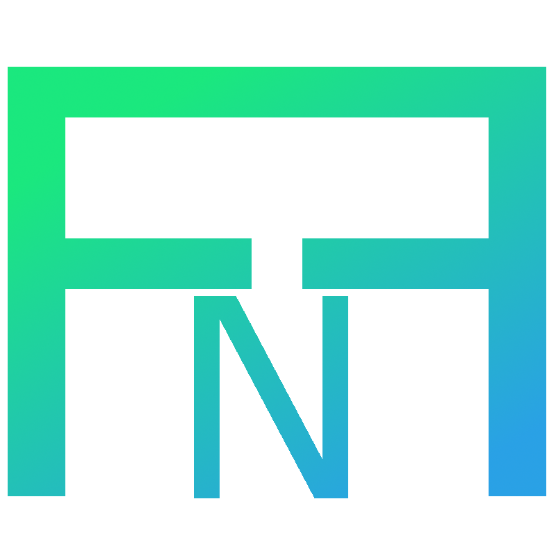

<!--
Credit to othnieldrew's https://github.com/othneildrew/Best-README-Template for formatting inspiration.
-->

<!-- PROJECT SHIELDS
[](https://nim-lang.org/)
[](https://github.com/oliversandli/NimFormattedFile/issues)
[](https://github.com/oliversandli/NimFormattedFile/blob/master/LICENSE)
-->

<!-- PROJECT LOGO -->
<br />
<p align="center">
    <a href="https://github.com/oliversandli/NimFormattedFile/wiki">
        
    </a>
    <h3 align="center">NimFormattedFile</h3>
    <p align="center">
        Instantly create pre-formatted files.
        <br />
        <a href="https://github.com/oliversandli/NimFormattedFile/wiki"><strong>Wiki »</strong></a>
        <br />
        <br />
        <a href="https://nim-lang.org/">
            
        </a>
        
        <a href="https://github.com/oliversandli/NimFormattedFile/issues">
            
        </a>
        <a href="https://github.com/oliversandli/NimFormattedFile/blob/master/LICENSE">
            
        </a>
        <br />
        <br />
        <a href="https://github.com/oliversandli/NimFormattedFile#getting-started">Getting Started</a>
        ·
        <a href="https://github.com/oliversandli/NimFormattedFile/issues">Report Bug</a>
        ·
        <a href="https://github.com/oliversandli/NimFormattedFile/issues">Request Feature</a>
    </p>
</p>

## Table of Contents

* [About](#about)
    * [Description](#description)
    * [Why Nim?](#why-nim)
* [Getting Started](#getting-started)
    * [Prerequisites](#prerequisites)
    * [Installation](#installation)
    * [Uninstallation](#uninstallation)
    * [Build From Source](#build-from-source)
* [Usage](#usage)
* [Roadmap](#roadmap)
* [License](#license)
* [Contact](#contact)

## About

**Current version:** `0.0.2`.

### Description

A brand-new version of [NewFormattedFile](https://github.com/oliversandli/NewFormattedFile), re-written in [Nim](https://nim-lang.org/).

`nff` creates a new file with the format specified by its matching config file. For example, a file ending in `.py` will be created with the contents of `nff`'s `py.tmpl`. The `*.tmpl` files are simply plain text. You can create any `*.tmpl` files for any file types you like, as long as the config file's name matches the file extension of the target file type (`hpp.tmpl` for `*.hpp` files, etc.)

### Why Nim?

Nim has become a very powerful, clean, and efficient language. It combines run-time speed with ease of development; I was able to write, from scratch, NimFormattedFile in one day, while NewFormattedFile took 3-4 days. Nim deserves to be used more widely-- and in an effort to further this cause, I have re-written NewFormattedFile in Nim, with an exciting roadmap of new features to come.

## Getting Started

NimFormattedFile works as a drop-in replacement to the old NewFormattedFile.

### Prerequisites

- [Nim](https://nim-lang.org/)

The easiest way to install Nim is to use [choosenim](https://github.com/dom96/choosenim#choosenim).

### Installation

1. Clone this repo.
```bash
git clone https://github.com/oliversandli/NimFormattedFile.git
```
2. `cd` into the cloned directory and run `install.sh`.
```bash
cd nimformattedfile
chmod +x install.sh  # IMPORTANT. Give the script executable permissions.
./install.sh
```

### Uninstallation

Run the provided uninstall script.
```bash
chmod +x uninstall.sh
./uninstall.sh
```

### Build From Source

1. Clone this repo.
```bash
git clone https://github.com/oliversandli/NimFormattedFile.git
```
2. Enter the directory, and compile `nff`.
```bash
cd nimformattedfile
nim c -d:release nff.nim
```
3. Copy the executable to `/usr/local/bin`.
4. If you have never installed any version of `nff` before, create the config directory in your default config directory (`$XDG_CONFIG_HOME` or `$HOME/.config`) and copy the `templates` folder there.
```bash
mkdir ~/.config/nff
cp templates ~/.config/nff
```
Otherwise, if you have previously installed `nff`, the C++ or Nim version, copy any `.tmpl` files you may not have to your `templates` folder.

## Usage

Just run `nff my_file.ext`. For example:
```bash
nff awesome_program.cpp
cat awesome_program.cpp

#include <iostream>

int main(int argc, char** argv) {
    std::cout << "C++ file generated by nff" << std::endl;
}
```

Run `nff --help` for complete help.
```bash
nff --help

NimFormattedFile v0.0.1
Create a new file designated by the input file's extension.
usage: nff [options] output_file
options:
    -v --version  output current version
    -h --help     ask for help
```

## Roadmap

See the [wiki](https://github.com/oliversandli/NimFormattedFile/wiki) for the roadmap.

## License

This project uses the [MIT License](https://github.com/oliversandli/NimFormattedFile/blob/master/LICENSE).

## Contact

Raise an Issue! I'll see you there.

Project link: [https://github.com/oliversandli/NimFormattedFile](https://github.com/oliversandli/NimFormattedFile)

